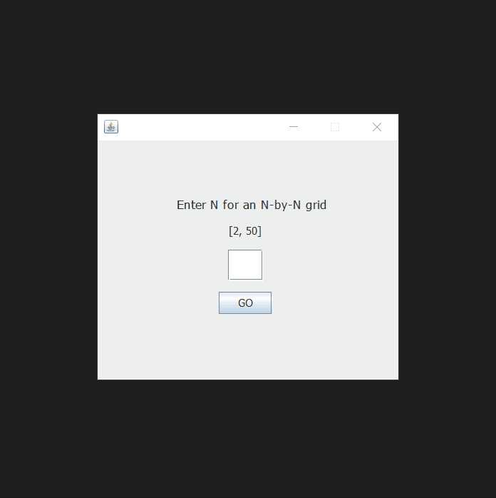

## Percolation

*https://coursera.cs.princeton.edu/algs4/assignments/percolation/specification.php*  
*Project based on the assignment above from Coursera's course (Algorithms Part I)*

"We model a percolation system using an n-by-n grid of sites. Each site is either open or blocked. A full site is an open site that can be connected to an open site in the top row via a chain of neighboring (left, right, up, down) open sites. 

The system percolates if there is a full site in the bottom row. In other words, a system percolates if we fill all open sites connected to the top row and that process fills some open site on the bottom row."

 

- Colors
  - Blocked site: Black
  - Open site but not full: Brown
  - Full site: Blue

### Demo
 

 

You can use the arrow keys to select the sites of the grid.

This percolation system is enabled by an Union-Find algorithm (Weighted Quick Union)

The executable .jar file is in the */dist* directory.
